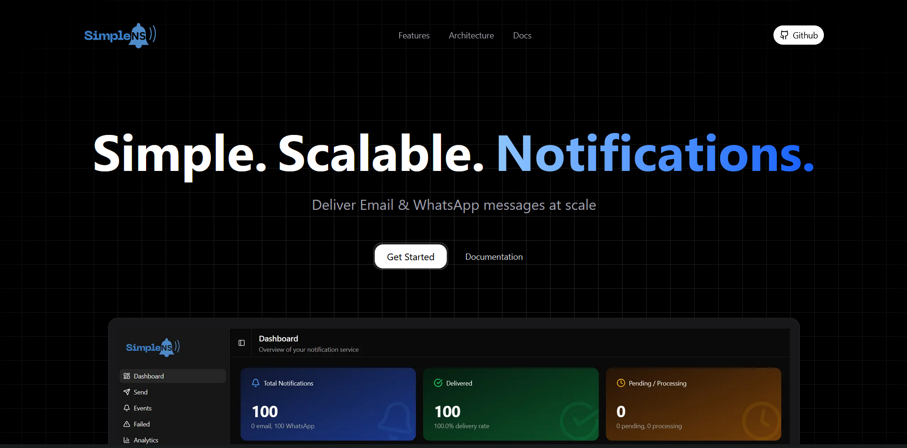
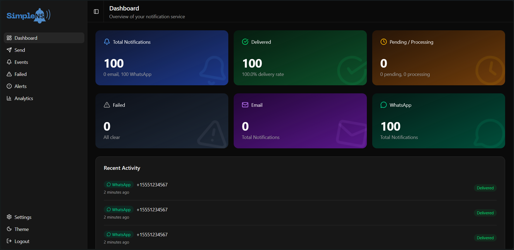

<p align="center">
    
</p>



SimpleNS (Simple Notification Service) is a lightweight, backend notification service for sending **EMAIL** and **WHATSAPP** messages. It supports single and batch notifications, scheduled deliveries, automatic retires, template variables, and webhook callbacks for delivery status updates.

---

## Table of Contents
- [Overview](#overview)
- [Admin Dashboard](#admin-dashboard)
- [Key Features](#key-features)
- [Architecture](#architecture)
- [Getting Started](#getting-started)
  - [Prerequisites](#prerequisites)
  - [Quick Start with Docker](#quick-start-with-docker)
  - [Local Development Setup](#local-development-setup)
- [Configuration](#configuration)
- [API Documentation](#api-documentation)
- [Service Components](#service-components)
- [Monitoring](#monitoring)

---

## Overview

This service provides a REST HTTP API for accepting notifications (EMAIL and WHATSAPP) and delivers them asynchronously using pluggable providers. It uses an event-driven architecture with Kafka for message routing, Redis for rate limiting and scheduled delivery, and MongoDB for persistence.

**For detailed API documentation, see [`docs/api/README.md`](./docs/api/README.md)**

---

## Key Features

- ✅ **Single & Batch Notifications** — Send to one or thousands of recipients
- ✅ **Multi-Channel Support** — EMAIL and WHATSAPP channels
- ✅ **Scheduled Delivery** — Schedule notifications for future delivery
- ✅ **Template Variables** — Personalize messages with dynamic content
- ✅ **Webhook Callbacks** — Real-time delivery status updates
- ✅ **Idempotency** — Safe retries without duplicates
- ✅ **Rate Limiting** — Token bucket algorithm to prevent provider throttling
- ✅ **Horizontal Scaling** — Scale processors independently
- ✅ **Dead Letter Queue** — Failed messages preserved for inspection

---

## Admin Dashboard

The Admin Dashboard is a Next.js web application for monitoring and managing notifications.



### Dashboard Features

- 📊 **Dashboard Overview** — Total, delivered, pending, and failed notification counts
- 📋 **Events Explorer** — Paginated table with filtering and search
- 🔴 **Failed Events Inspector** — View and batch-retry failed notifications
- 📈 **Analytics** — Charts for status and channel distribution
- 🔐 **Authentication** — Username/password login with session management

### Access

- **URL**: http://localhost:3002
- **Default credentials** (configure via environment variables):
  - Username: `admin`
  - Password: `admin`

### Dashboard Configuration

| Variable | Description | Default |
|----------|-------------|---------|
| `AUTH_SECRET` | NextAuth session encryption secret | Required |
| `ADMIN_USERNAME` | Dashboard login username | `admin` |
| `ADMIN_PASSWORD` | Dashboard login password | `admin` |

### Dashboard Local Development

```bash
cd dashboard
npm install
npm run dev
```

---

## Architecture


### Components

| Component | Description |
|-----------|-------------|
| **API Server** | HTTP REST API for `/notification` and `/notification/batch` |
| **Background Worker** | Polls outbox, publishes to Kafka, consumes status updates |
| **Email Processor** | Consumes email notifications, sends via SMTP |
| **WhatsApp Processor** | Consumes WhatsApp notifications, sends via API |
| **Delayed Processor** | Handles scheduled notifications via Redis ZSET queue |

---

## Getting Started

### Prerequisites

- **Docker & Docker Compose** (recommended)
- Or for local development:
  - Node.js 20+
  - MongoDB 7.0+ (replica set mode)
  - Apache Kafka
  - Redis 7+

### Quick Start with Docker

1. **Clone the repository**
   ```bash
   git clone https://github.com/Adhish-Krishna/backend-notification-service.git
   cd backend-notification-service
   ```

2. **Configure environment variables**
   ```bash
   # Copy example env file
   cp .env.example .env
   
   # Edit .env and set required values:
   # - NS_API_KEY (generate with: openssl rand -base64 32)
   # - EMAIL_USER, EMAIL_PASS, EMAIL_FROM (for email delivery)
   ```

3. **Start all services**
   ```bash
   # Start infrastructure + application services
   docker-compose build
   docker compose up -d
   ```

4. **Verify services are running**
   ```bash
   # Check all containers
   docker-compose ps
   
   # Check API health
   curl http://localhost:3000/health
   
   # View logs
   docker-compose logs -f api
   docker-compose logs -f email-processor
   ```

5. **Send a test notification**
   ```bash
   curl -X POST http://localhost:3000/api/notification \
     -H "Content-Type: application/json" \
     -H "Authorization: Bearer YOUR_API_KEY" \
     -d '{
       "request_id": "test-001",
       "client_id": "my-app",
       "channel": ["email"],
       "recipient": {
         "user_id": "user-1",
         "email": "recipient@example.com"
       },
       "content": {
         "email": {
           "subject": "Hello!",
           "message": "<h1>Welcome!</h1><p>This is a test notification.</p>"
         }
       },
       "webhook_url": "https://your-webhook.com/callback"
     }'
   ```

6. **Stop services**
   ```bash
   docker-compose down
   
   # To also remove volumes (data)
   docker-compose down -v
   ```

### Local Development Setup

1. **Install dependencies**
   ```bash
   npm install
   ```

2. **Start infrastructure only**
   ```bash
   # Start MongoDB, Kafka, Redis (without app services)
   docker-compose up -d mongo kafka redis kafka-ui
   ```

3. **Configure environment**
   ```bash
   cp .env.example .env
   # Edit .env with your local settings
   ```

4. **Build TypeScript**
   ```bash
   npm run build
   ```

5. **Run services in separate terminals**
   ```bash
   # Terminal 1: API Server
   npm run dev
   
   # Terminal 2: Background Worker
   npm run worker:dev
   
   # Terminal 3: Email Processor
   npm run email-processor:dev
   
   # Terminal 4: WhatsApp Processor
   npm run whatsapp-processor:dev
   
   # Terminal 5: Delayed Processor
   npm run delayed-processor:dev
   ```

### Scaling Processors

For horizontal scaling, run multiple instances:

```bash
# Scale email processor to 3 instances
docker-compose up -d --scale email-processor=3

# Scale WhatsApp processor to 2 instances
docker-compose up -d --scale whatsapp-processor=2

#Scale multiple services using the same command
docker-compose up -d --scale <service_name>=<count> --scale <service_name>=<count> ...
```

---

## Configuration

All configuration is done via environment variables. See [`.env.example`](./.env.example) for the complete list.

### Key Configuration Options

| Variable | Description | Default |
|----------|-------------|---------|
| `NS_API_KEY` | API authentication key | Required |
| `PORT` | API server port | `3000` |
| `MONGO_URI` | MongoDB connection string | `mongodb://127.0.0.1:27017/notification_service` |
| `REDIS_URL` | Redis connection URL | `redis://localhost:6379` |
| `BROKERS` | Kafka broker list | `localhost:9092` |
| `EMAIL_HOST` | SMTP server host | `smtp.gmail.com` |
| `EMAIL_PORT` | SMTP server port | `587` |
| `EMAIL_USER` | SMTP username | Required for email |
| `EMAIL_PASS` | SMTP password/app password | Required for email |
| `MAX_RETRY_COUNT` | Max delivery retries | `5` |
| `LOKI_URL` | Grafana Loki URL for logging | `http://loki:3100` (Docker) |
| `LOG_LEVEL` | Minimum log level | `info` |

### Gmail Setup

To use Gmail SMTP:
1. Enable 2-Factor Authentication on your Google account
2. Generate an App Password at https://myaccount.google.com/apppasswords
3. Use the app password as `EMAIL_PASS`

---

## API Documentation

**Full API documentation: [`docs/api/README.md`](./docs/api/README.md)**

### Quick Reference

| Endpoint | Method | Description |
|----------|--------|-------------|
| `/health` | GET | Health check |
| `/notification` | POST | Send single notification |
| `/notification/batch` | POST | Send batch notifications |

### Authentication

All `/notification` endpoints require Bearer token authentication:
```
Authorization: Bearer YOUR_API_KEY
```

---

## Service Components

| Service | Docker Container | npm Script | Port |
|---------|-----------------|------------|------|
| API Server | `ns-api` | `npm run start` | 3000 |
| Background Worker | `ns-worker` | `npm run worker` | - |
| Email Processor | `ns-email-processor` | `npm run email-processor` | - |
| WhatsApp Processor | `ns-whatsapp-processor` | `npm run whatsapp-processor` | - |
| Delayed Processor | `ns-delayed-processor` | `npm run delayed-processor` | - |
| **Admin Dashboard** | `ns-dashboard` | `cd dashboard && npm run start` | 3002 |
| Grafana | `grafana` | - | 3001 |
| Loki | `loki` | - | 3100 |
| Kafka UI | `kafka-ui` | - | 8080 |

---

## Monitoring

- **Grafana Dashboard**: http://localhost:3001 — Log visualization and monitoring
  - Default login: admin / admin
  - Loki data source is auto-configured
- **Grafana Loki**: http://localhost:3100 — Log aggregation (internal)
- **Kafka UI**: http://localhost:8080 — Monitor Kafka topics and messages
- **API Health**: http://localhost:3000/health — API health check

### Viewing Logs in Grafana

1. Open Grafana at http://localhost:3001
2. Go to **Explore** (compass icon in sidebar)
3. Select **Loki** as the data source
4. Use LogQL to query logs:
   ```logql
   # All logs from a specific service
   {service="api"}
   
   # Filter by notification ID
   {service="email-processor"} |= "notification_id"
   
   # Filter by log level
   {service="worker"} | json | level="error"
   
   # Search across all services
   {job="notification-service"} |= "failed"
   ```

### Log Labels

All logs are tagged with these labels:
- `job`: `notification-service` (all services)
- `service`: `api`, `worker`, `email-processor`, `whatsapp-processor`, `delayed-processor`
- `environment`: `development` or `production`
- `worker_id`: Unique identifier for each processor instance

---
