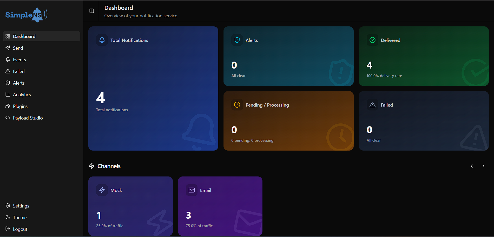

<p align="center">
    
</p>

<h3 align="center">Plugin-Based Notification Orchestration</h3>

<p align="center">
  <strong>Scalable • Reliable • Extensible</strong>
</p>

<p align="center">
  <a href="#key-features">Features</a> •
  <a href="#architecture">Architecture</a> •
  <a href="#quick-start">Quick Start</a> •
  <a href="#admin-dashboard">Dashboard</a> •
  <a href="https://simplens-docs.vercel.app">Docs</a>
</p>

---

**SimpleNS** is a self-hosted notification orchestration engine that manages delivery workflows—retries, scheduling, crash recovery, and scaling—while delegating the actual sending to **plugins**. Build your own providers or use community plugins to support any channel: Email, SMS, WhatsApp, Push, and beyond.

---

## Why SimpleNS?

| ❌ The Problem | ✅ How SimpleNS Solves It |
|----------------|---------------------------|
| Locked into a single notification provider | **Plugin architecture** — swap providers without code changes |
| Notifications fail silently | **Exponential backoff retries** with configurable limits |
| Crashes leave messages stuck | **Crash recovery service** detects & rescues orphaned notifications |
| Single point of failure | **Horizontally scalable** workers and processors |
| Complex scheduling logic | **Built-in scheduled delivery** with Redis-backed queues |
| Different APIs for each channel | **Unified API** for all notification channels |

---

## Key Features

- 🔌 **Plugin-Based Delivery** — Delegate sending to any provider plugin
- 🔄 **Exponential Backoff Retries** — Automatic retry with increasing delays
- 🛡️ **Crash Recovery** — Detect and rescue orphaned notifications
- ⏰ **Scheduled Delivery** — Queue notifications for future delivery
- 📈 **Horizontal Scaling** — Scale processors independently per channel
- 📡 **Multi-Channel Support** — Email, WhatsApp, SMS, Push via plugins
- 🚦 **Rate Limiting** — Per-provider token bucket algorithm
- 🔔 **Webhook Callbacks** — Real-time delivery status updates
- 📊 **Admin Dashboard** — Monitor, search, and retry notifications
- 📋 **Observability** — Centralized logging with Grafana + Loki

---

## Architecture


| Component | Description |
|-----------|-------------|
| **API Server** | REST API for notification ingestion (`/notification`, `/notification/batch`) |
| **Background Worker** | Polls outbox, publishes to Kafka, consumes status updates |
| **Unified Processor** | Plugin-based notification delivery with rate limiting |
| **Delayed Processor** | Handles scheduled notifications via Redis ZSET queue |
| **Recovery Service** | Detects stuck notifications and reschedules them |

### Plugin System

SimpleNS Core handles **orchestration**; plugins handle **delivery**.

```bash
# Install a plugin
npm run plugin:install @simplens/nodemailer-gmail

# List installed plugins
npm run plugin:list
```

Build custom plugins with the SDK:

```typescript
import { SimpleNSProvider, ProviderManifest } from '@simplens/sdk';

class MyProvider implements SimpleNSProvider {
  readonly manifest: ProviderManifest = {
    name: 'my-provider',
    channel: 'email',
    // ...
  };
  
  async send(notification) {
    // Your delivery logic
    return { success: true, messageId: 'msg-123' };
  }
}
```

---

## Quick Start

### Prerequisites

- Docker & Docker Compose

### 1. Clone & Configure

```bash
git clone https://github.com/SimpleNotificationSystem/simplens-core.git
cd simplens-core

# Configure environment
cp .env.example .env
# Edit .env with your settings

#Install dependencies
npm install

#Install a plugin to get started
npm run plugin:install @simplens/nodemailer-gmail

# Generates simplens.config.yaml. Add credentials to .env to start.
```

### 2. Start Services

```bash
docker-compose build
docker-compose up -d
```

### 3. Send a Notification (using @simplens/nodemailer-gmail)

```bash
curl -X POST http://localhost:3000/api/notification \
  -H "Content-Type: application/json" \
  -H "Authorization: Bearer NS_API_KEY" \
  -d '{
    "request_id": "<UUIDV4>",
    "client_id": "<UUIDV4>",
    "channel": ["email"],
    "recipient": {
      "user_id": "<string>",
      "email": "<valid email>"
    },
    "content": {
      "email": {
        "subject": "Hello from SimpleNS!",
        "message": "<h1>Welcome!</h1><p>Your notification system is working.</p>"
      }
    }
  }'
```

### 4. Check the Dashboard

Open [http://localhost:3002](http://localhost:3002) and login with (default credentials. You can change them in .env):
- **Username:** `admin`
- **Password:** `admin`

---

## Admin Dashboard



The Admin Dashboard provides a modern interface for monitoring and managing notifications:

- 🏠 **Dashboard Home** — Overview with status cards showing total, delivered, pending, and failed counts
- 📡 **Channel Cards** — Visual cards for each configured channel (Email, WhatsApp, etc.) with quick navigation
- 📋 **Events Explorer** — Paginated event table with filtering, search, and status indicators
- 🔴 **Failed Events** — Dedicated view for failed notifications with retry capabilities
- 🚨 **Alerts** — System alerts for orphaned notifications and recovery events requiring attention
- 📈 **Analytics** — Charts and visualizations for notification status and channel distribution
- 🔌 **Plugins** — View installed plugins, their channels, and provider configurations
- 🔧 **Payload Studio** — Interactive schema explorer for building and testing notification payloads

---

## License

MIT License — see [LICENSE](./LICENSE) for details.

---

<p align="center">
  <sub>Built with ❤️ for developers who need reliable notifications</sub>
</p>
